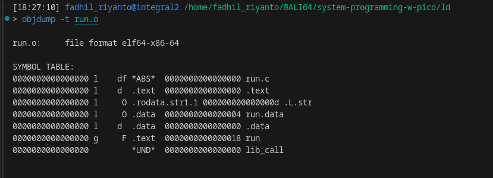
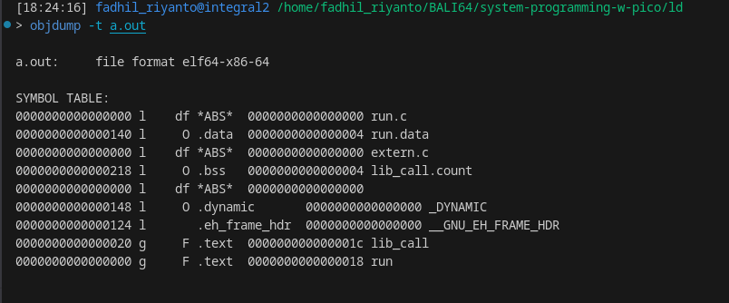
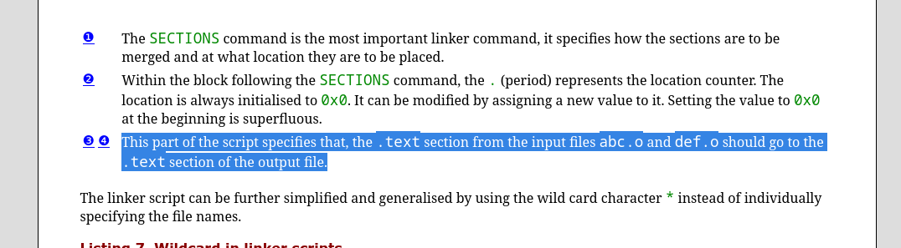

# GNU linker scripts 2

first, in this section I will fix all of inconsistency in [ld-script.md](/sysprog/ld-script.md)

# what is section
>> An object file is divided into sections containing different types of data. In the most common case, there are three sections: the text section, which holds instructions and read-only data; the data section, which holds initialized writable data; and the bss section, which holds uninitialized data. Some systems have other kinds of sections. 

source: [https://gcc.gnu.org/onlinedocs/gcc-8.3.0/gccint/Sections.html](https://gcc.gnu.org/onlinedocs/gcc-8.3.0/gccint/Sections.html)

my tldr is

- .data           = static initialized variable
- .bss            = static uninitialized variable
- .rodata = hold read only data
- .shstrtab       = display all section text
- .symtab		  = symbol section 
- .rel 			  = relocation

# Linker playground

```c
/* extern.c */

int lib_call(const char *str) {
        (void)str;

        static int count;
        count++;
}

```

```c
/* run.c */

extern int  lib_call(const char* str);

void run(void) {
        /* this will be .data */
        static int data = 5;

        data = lib_call("im a .rodata");
}
```


```asm

// startfiles.S 

.extern run

.global main 

main: 
        call run
        xor    %eax,%eax
        ret
```

our linker script, named `link.ld`
```
ENTRY(run)

PHDRS {
        text PT_LOAD FLAGS(5); /* RX */
        data PT_LOAD FLAGS(6); /* RW */
}

SECTIONS {
        .text : { 
                *(.text); 
                *(.text.*) 
        } : text

        .rodata : { 
                *(.rodata); 
                *(.rodata.*) 
        }

        .data : {
                *(.data);
                *(.data.*)
        }

        .bss : {
                *(.bss);
                *(.bss.*)
        }
}
```


compile using

- `clang -c extern.c`
- `ar rc libextern.a extern.o`

we get `libextern.a`, which statically libraries, link it with 

`clang run.o -L. -lextern -nostartfiles`

or optionally, let's use makefile

```makefile
mk_libextern: extern.c
	clang -c extern.c
	ar rc libextern.a extern.o

mk_run: run.c
	clang -c run.c

all: mk_libextern mk_run
	clang run.o -L. -lextern -nostartfiles

all_custom_ld: mk_libextern mk_run
	clang run.o -L. -lextern -nostartfiles -nostdlib -Wl,-T,link.ld -v

clean:
	rm -f a.out
	rm -f libextern.a
	rm -f extern.o
	rm -f run.o
	
```

testing time

1. 

why `0000000000000000         *UND*  0000000000000000 lib_call` is undefined? because we dont link it with `libextern`, so linker need to do symbol resolution

here the final executable



> Linker scripts are text files. 
[https://sourceware.org/binutils/docs/ld/Script-Format.html](https://sourceware.org/binutils/docs/ld/Script-Format.html), right. because of its text files, it has a rules

[https://sourceware.org/binutils/docs/ld/Script-Format.html](https://sourceware.org/binutils/docs/ld/Script-Format.html)

there that I thing the [roadmap](https://sourceware.org/binutils/docs/ld/Simple-Commands.html)


# x86_64 playground
use this IF You want do some nice playground (that actually run'able). also



in this blog, each `.text` section from many `*.o` file, will be merged together. I'll proof it

## create entrypoint
save this file as `startup.S`, this contain `_start` that will be our entry

see? its call `main`
```asm
// startup.S
.global _start
_start:
    call main
    mov $60, %rax 
    mov %eax, %edi
    syscall

```

## create our main
```c
/* main.c */
int global_var = 42;

extern int lib_call(const char *str);

static inline long sys_write(int fd, const void *buf, unsigned long count) {
        long ret;
        __asm__ volatile("syscall"
                         : "=a"(ret)
                         : "a"(1), "D"(fd), "S"(buf), "d"(count)
                         : "rcx", "r11", "memory");
        return ret;
}

static inline __attribute__((noreturn)) void sys_exit(int status) {
        __asm__ volatile("syscall"
                         :
                         : "a"(60),
                           "D"(status)
                         : "rcx", "r11", "memory");
        __builtin_unreachable();
}

int main(void) {
        lib_call("a"); 
        sys_write(1, "hey\n", 4);
        while (1) {
        }
        return 0;
}

```

but where lib_call go off? let's create `extern.c`

## the `extern.o` library

```c
int lib_call(const char *str) {
        (void)str;

        static int count;
        count++;
}
```

## linker

then, the `linker.ld` (this is the our experiment)

```text
ENTRY(_start)

SECTIONS {
    . = 0x100000;

    .text : {
        *(.text*)
    }

    .rodata : {
        *(.rodata*)
    }

    .data : {
        *(.data*)
    }

    .bss : {
        *(.bss*) *(COMMON)
    }
}

```

## makefile

```makefile
mk_extern: extern.c
	clang -c extern.c -o extern.o 

mk_main: main.c
	clang -c main.c -o main.o 

mk_startup: startup.S
	clang -c startup.S -o startup.o 

mk_all: mk_startup mk_main mk_extern
	clang -v -nostdlib -no-pie -T linker.ld startup.o main.o extern.o -o prog.elf

clean: 
	rm -f main.o
	rm -f extern.o
	rm -f prog.elf
```

compile with `make mk_all`

# binary analysis

let's decompile each object file with `objdump -d -s .text <filename>`, and here the result


## extern.c

```text
/**
 * this is objdump for extern.c
 */
 
fadhil_riyanto@integral2: 21:58:36 08/16/25 $ objdump -d -j .text ./extern.o

./extern.o:     file format elf64-x86-64


Disassembly of section .text:

0000000000000000 <lib_call>:
   0:	55                   	push   %rbp
   1:	48 89 e5             	mov    %rsp,%rbp
   4:	48 89 7d f0          	mov    %rdi,-0x10(%rbp)
   8:	8b 05 00 00 00 00    	mov    0x0(%rip),%eax        # e <lib_call+0xe>
   e:	83 c0 01             	add    $0x1,%eax
  11:	89 05 00 00 00 00    	mov    %eax,0x0(%rip)        # 17 <lib_call+0x17>
  17:	8b 45 fc             	mov    -0x4(%rbp),%eax
  1a:	5d                   	pop    %rbp
  1b:	c3                   	ret

```

## main.c
```text

/**
 * this is objdump for main.c
 */
fadhil_riyanto@integral2: 22:22:47 08/16/25 $ objdump -d -j .text ./main.o

./main.o:     file format elf64-x86-64


Disassembly of section .text:

0000000000000000 <main>:
   0:	55                   	push   %rbp
   1:	48 89 e5             	mov    %rsp,%rbp
   4:	48 83 ec 10          	sub    $0x10,%rsp
   8:	c7 45 fc 00 00 00 00 	movl   $0x0,-0x4(%rbp)
   f:	48 8d 3d 00 00 00 00 	lea    0x0(%rip),%rdi        # 16 <main+0x16>
  16:	e8 00 00 00 00       	call   1b <main+0x1b>
  1b:	bf 01 00 00 00       	mov    $0x1,%edi
  20:	48 8d 35 00 00 00 00 	lea    0x0(%rip),%rsi        # 27 <main+0x27>
  27:	ba 04 00 00 00       	mov    $0x4,%edx
  2c:	e8 0f 00 00 00       	call   40 <sys_write>
  31:	eb fe                	jmp    31 <main+0x31>
  33:	66 66 66 66 2e 0f 1f 	data16 data16 data16 cs nopw 0x0(%rax,%rax,1)
  3a:	84 00 00 00 00 00 

0000000000000040 <sys_write>:
  40:	55                   	push   %rbp
  41:	48 89 e5             	mov    %rsp,%rbp
  44:	89 7d fc             	mov    %edi,-0x4(%rbp)
  47:	48 89 75 f0          	mov    %rsi,-0x10(%rbp)
  4b:	48 89 55 e8          	mov    %rdx,-0x18(%rbp)
  4f:	8b 7d fc             	mov    -0x4(%rbp),%edi
  52:	48 8b 75 f0          	mov    -0x10(%rbp),%rsi
  56:	48 8b 55 e8          	mov    -0x18(%rbp),%rdx
  5a:	b8 01 00 00 00       	mov    $0x1,%eax
  5f:	0f 05                	syscall
  61:	48 89 45 e0          	mov    %rax,-0x20(%rbp)
  65:	48 8b 45 e0          	mov    -0x20(%rbp),%rax
  69:	5d                   	pop    %rbp
  6a:	c3                   	ret

```

# startup.S

```text

/**
 * this is objdump for startup.S
 */
fadhil_riyanto@integral2: 22:23:17 08/16/25 $ objdump -d -j .text ./startup.o

./startup.o:     file format elf64-x86-64


Disassembly of section .text:

0000000000000000 <_start>:
   0:	e8 00 00 00 00       	call   5 <_start+0x5>
   5:	48 c7 c0 3c 00 00 00 	mov    $0x3c,%rax
   c:	89 c7                	mov    %eax,%edi
   e:	0f 05                	syscall
```

## overall

```text
fadhil_riyanto@integral2: 22:25:06 08/16/25 $ objdump -d -j .text prog.elf

prog.elf:     file format elf64-x86-64


Disassembly of section .text:

0000000000100000 <_start>:
  100000:	e8 0b 00 00 00       	call   100010 <main>
  100005:	48 c7 c0 3c 00 00 00 	mov    $0x3c,%rax
  10000c:	89 c7                	mov    %eax,%edi
  10000e:	0f 05                	syscall

0000000000100010 <main>:
  100010:	55                   	push   %rbp
  100011:	48 89 e5             	mov    %rsp,%rbp
  100014:	48 83 ec 10          	sub    $0x10,%rsp
  100018:	c7 45 fc 00 00 00 00 	movl   $0x0,-0x4(%rbp)
  10001f:	48 8d 3d 76 00 00 00 	lea    0x76(%rip),%rdi        # 10009c <lib_call+0x1c>
  100026:	e8 55 00 00 00       	call   100080 <lib_call>
  10002b:	bf 01 00 00 00       	mov    $0x1,%edi
  100030:	48 8d 35 67 00 00 00 	lea    0x67(%rip),%rsi        # 10009e <lib_call+0x1e>
  100037:	ba 04 00 00 00       	mov    $0x4,%edx
  10003c:	e8 0f 00 00 00       	call   100050 <sys_write>
  100041:	eb fe                	jmp    100041 <main+0x31>
  100043:	66 66 66 66 2e 0f 1f 	data16 data16 data16 cs nopw 0x0(%rax,%rax,1)
  10004a:	84 00 00 00 00 00 

0000000000100050 <sys_write>:
  100050:	55                   	push   %rbp
  100051:	48 89 e5             	mov    %rsp,%rbp
  100054:	89 7d fc             	mov    %edi,-0x4(%rbp)
  100057:	48 89 75 f0          	mov    %rsi,-0x10(%rbp)
  10005b:	48 89 55 e8          	mov    %rdx,-0x18(%rbp)
  10005f:	8b 7d fc             	mov    -0x4(%rbp),%edi
  100062:	48 8b 75 f0          	mov    -0x10(%rbp),%rsi
  100066:	48 8b 55 e8          	mov    -0x18(%rbp),%rdx
  10006a:	b8 01 00 00 00       	mov    $0x1,%eax
  10006f:	0f 05                	syscall
  100071:	48 89 45 e0          	mov    %rax,-0x20(%rbp)
  100075:	48 8b 45 e0          	mov    -0x20(%rbp),%rax
  100079:	5d                   	pop    %rbp
  10007a:	c3                   	ret
  10007b:	0f 1f 44 00 00       	nopl   0x0(%rax,%rax,1)

0000000000100080 <lib_call>:
  100080:	55                   	push   %rbp
  100081:	48 89 e5             	mov    %rsp,%rbp
  100084:	48 89 7d f0          	mov    %rdi,-0x10(%rbp)
  100088:	8b 05 da 00 00 00    	mov    0xda(%rip),%eax        # 100168 <lib_call.count>
  10008e:	83 c0 01             	add    $0x1,%eax
  100091:	89 05 d1 00 00 00    	mov    %eax,0xd1(%rip)        # 100168 <lib_call.count>
  100097:	8b 45 fc             	mov    -0x4(%rbp),%eax
  10009a:	5d                   	pop    %rbp
  10009b:	c3                   	ret

```

this show us that `.text` is actually merged. but how it works?!