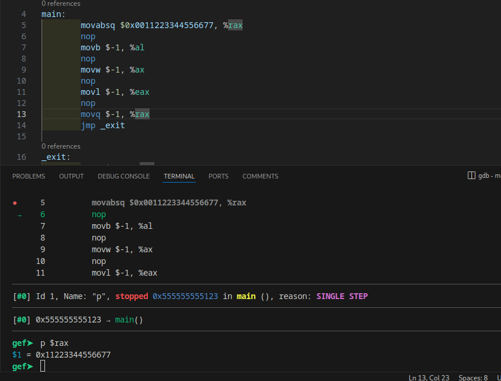
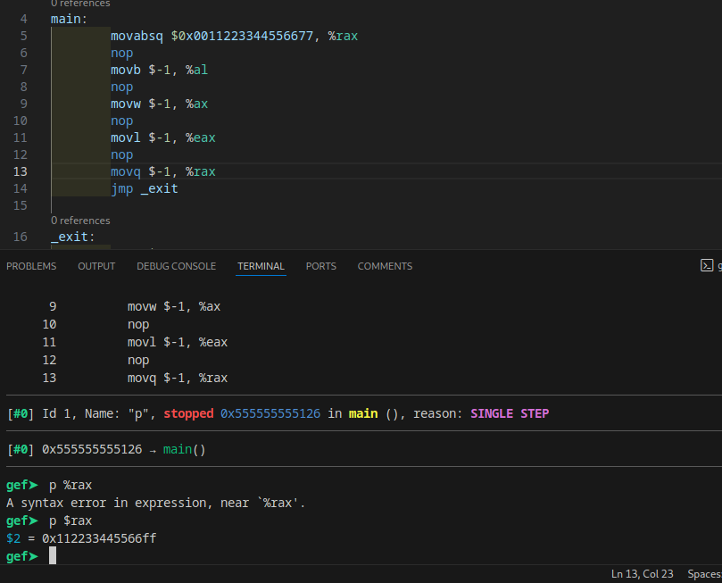
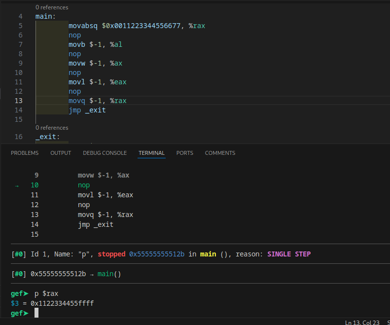
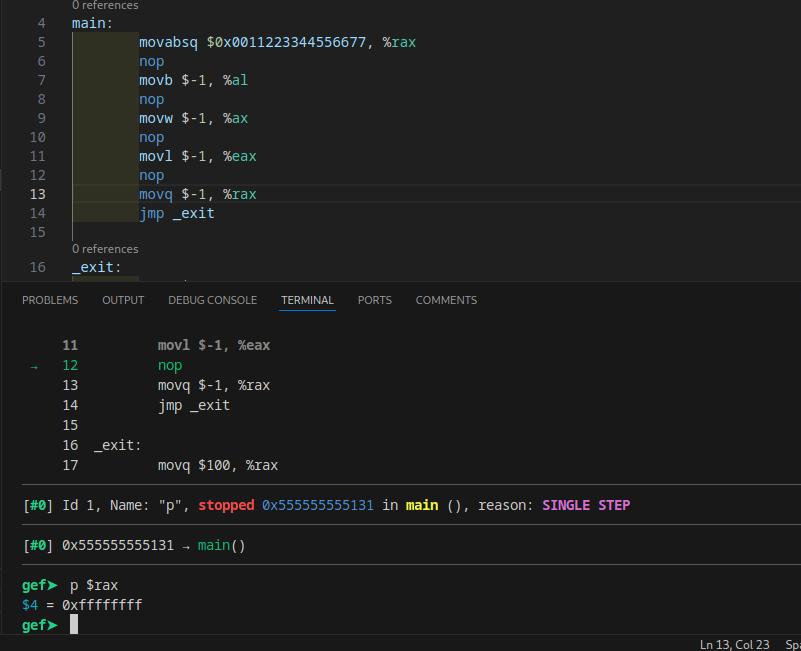
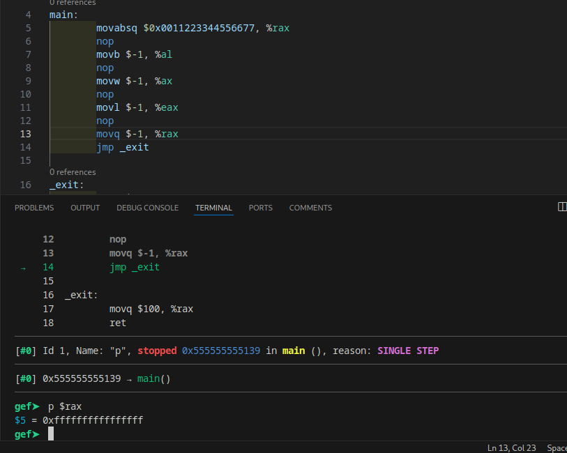

# movabsq
simplenya, ini kepanjangan dari move absolute quad word (64 bit)
contoh kecil

itu contoh initial moveabsq int 64 bit, lalu

contoh move 1 bytes

move 16 bit, 2 bytes word

move 32 bit, 4 bytes, tapi disini keformat sebagai int32 wkwk

full 64 bit move