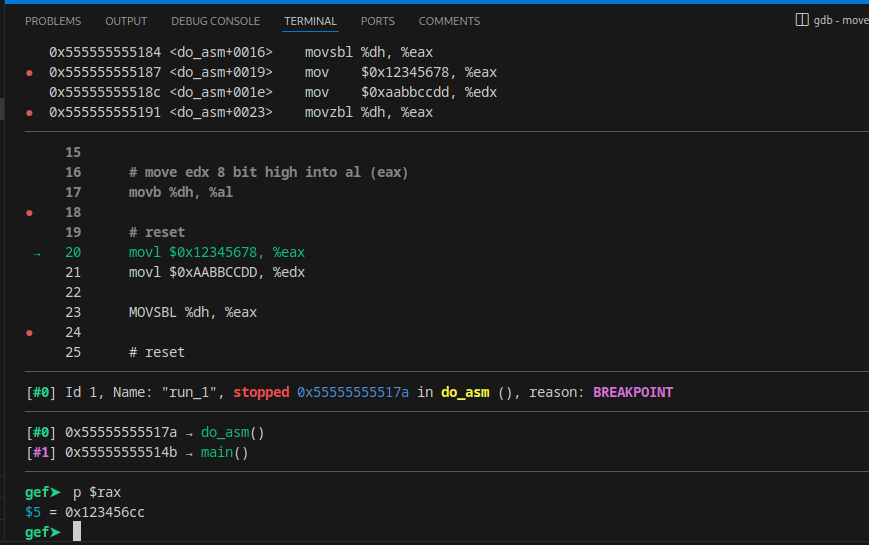
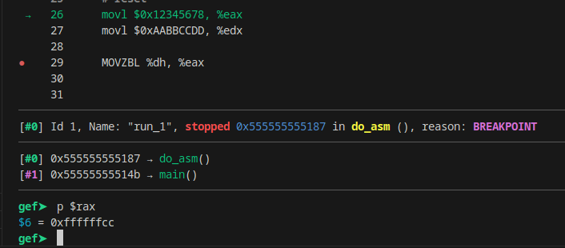
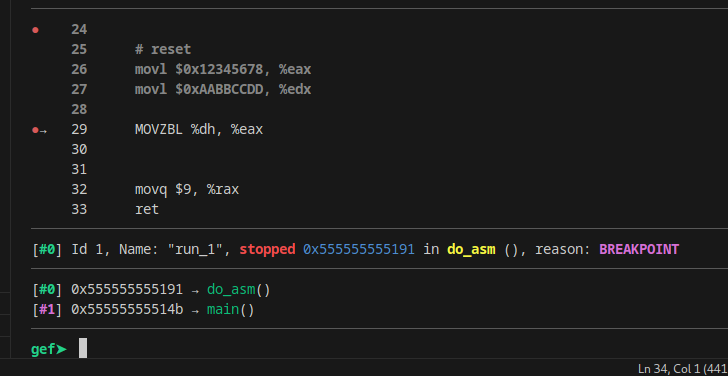

# Move sign & zero-extends a single byte

Disini saya akan membahas apa itu instruksi MOVSBL dan MOVZBL. pertama tama silahkan baca dulu disini
- [https://stackoverflow.com/questions/7861095/what-does-movsbl-instruction-do](https://stackoverflow.com/questions/7861095/what-does-movsbl-instruction-do)


```text
MOVSBL and MOVZBL
* MOVSBL sign-extends a single byte, and copies it into a
  double-word destination
* MOVZBL expands a single byte to 32 bits with 24 leading
  zeros, and copies it into a double-word destination
```

pertama tama, lihat kode asm ini.

```asm

.section .data
val:
    .byte 0xF6
    .byte 0xF6
    .byte 0xF6
    .byte 0xF6
    

.globl do_asm

.text
do_asm:
    movl $0x12345678, %eax
    movl $0xAABBCCDD, %edx 

    # move edx 8 bit high into al (eax)
    movb %dh, %al

    # reset
    movl $0x12345678, %eax
    movl $0xAABBCCDD, %edx 

    MOVSBL %dh, %eax

    # reset
    movl $0x12345678, %eax
    movl $0xAABBCCDD, %edx 

    MOVZBL %dh, %eax

    
    movq $9, %rax
    ret

```

dan ini hasilnya, movb biasa (tanpa hapus bagian atas data, bagian atas tetep utuh)


ini hasil signed bagian atas


ini hasil ketika bagian atas kita zerokan


catatan
`movb %dh, %al` memindahkan rdx bagian high ke rax bagian bawah.