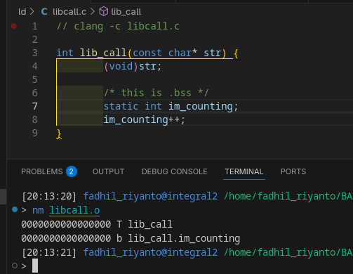

# nm

nm is a abbr of name, in linux. this tool is used to inspect binary section 

example



```txt
> nm libcall.o
0000000000000000 T lib_call
0000000000000000 b lib_call.im_counting
```

capital letter mean, the `symbol is exported`