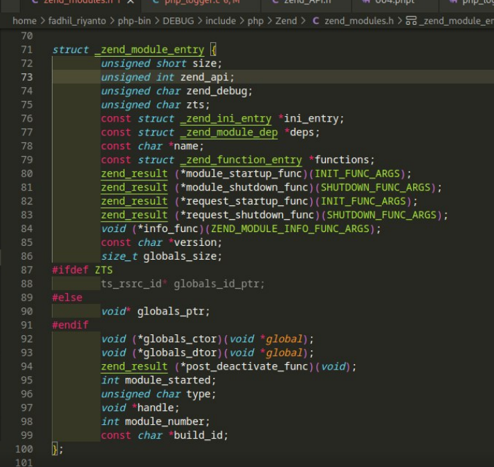

# PHP-SRC minit()

[https://github.com/php/php-src/blob/3704947696fe0ee93e025fa85621d297ac7a1e4d/main/main.c#L2009](https://github.com/php/php-src/blob/3704947696fe0ee93e025fa85621d297ac7a1e4d/main/main.c#L2009)

Ketika module PHP diload ke zend engine, yang dipanggil adalah MINIT(), di step ini yg terjadi cuman memory alokasi di ZendMM, dan disini engga ada process atau thread yg dijalan, pure cuman initialisasi data

nah, yang mentrigger MINIT() adalah zend_startup_modules(), trus secara beurutan, ia jg manggil RINIT() via PHP_RINIT_FUNCTION()

struct nya
 zend_result (*request_startup_func)(INIT_FUNC_ARGS);