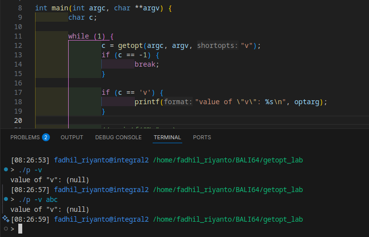
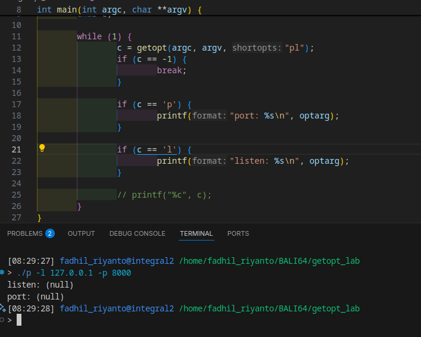
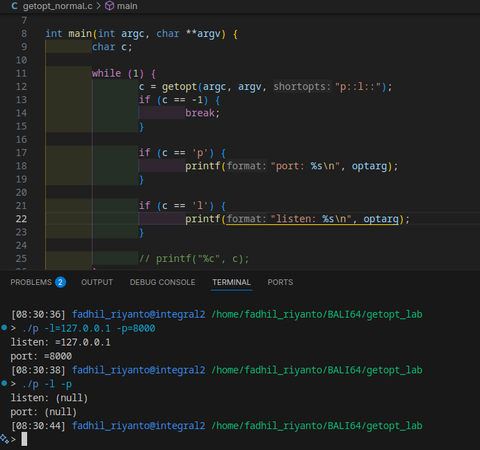

# POSIX getopt_long

optarg

- `:` for required arguments, for example
	- `f:` expands to `-f abc`
	- no `:` treated only as args, example `-v`

- `::` treated as optional args

## usage
read `man 3 getopt`

tldr

## lets construct array of option struct 

definition:

```c
struct option {
	const char *name;				// param name
	int         has_arg;			// set 1 or 0 (no)
	int        *flag;				// always 0
	int         val;				// whatever, 1 byte, used for switch block identification in future
};
```

example:
```c
static struct option long_options[] = {
    {"file", 1, 0, 'f'},
    {"elf", 1, 0, 'e'},
    NULL
};
```

## example

```c
static int parse_options(int argc, char *argv[], struct gwdown_ctx *ctx)
{
	int ret = 0;

	while (1) {
		int c;

		c = getopt_long(argc, argv, "hvo:t:rVM", long_options, NULL);
		if (c == -1)
			break;

		switch (c) {
		case 'h':
			help(argv[0]);
			ret = 255;
			goto out;
		case 'v':
			printf("gwdown 0.1\n");
			ret = 255;
			goto out;
		case 'o':
			ctx->output = optarg;
			break;
		case 't':
			ctx->num_threads = (uint16_t)atoi(optarg);
			break;
		case 'r':
			ctx->resume = true;
			break;
		case 'V':
			ctx->verbose = true;
			break;
		case 'M':
			ctx->use_mmap = true;
			break;
		default:
			printf("Error: Unknown option '%s'\n\n", argv[optind]);
			help(argv[0]);
			ret = -EINVAL;
			goto out;
		}
	}

	if (ctx->num_threads > 512) {
		printf("Error: Too many threads, max allowed thread is 512\n\n");
		ret = -EINVAL;
		goto out;
	}

	if (optind < argc) {
		ctx->url = strdup(argv[optind]);
		if (!ctx->url)
			ret = -ENOMEM;
	} else {
		printf("Error: Missing url argument\n\n");
		help(argv[0]);
		ret = -EINVAL;
	}

	if (ctx->resume) {
		printf("Error: The resume feature is currently not supproted\n");
		printf("       It's still just a draft feature\n\n");
		ret = -EOPNOTSUPP;
	}

out:
	return ret;
}
```

as you can see, optarg is magically return current character based on switch case cond

# POSIX getopt (only)
its parse command line like this

## no args params
this option did not receive any arguments, so the optarg value is will be null
`./prog -v`, use optstring something like this `v`



## optional params
`./prog -p=8000 -l=127.0.0.1`, use optsting `p::l::`

this is wrong example


this is good example


## required params
`./prog -p 8000 -l 0.0.0.0` use optstring `p:l:`


# unknown option handling
the handling is very easy, `getopt()` return `?` when undefined rule is provided, then you can use `optopt` as a handler

# useful links

- [https://www.gnu.org/software/libc/manual/html_node/Example-of-Getopt.html](https://www.gnu.org/software/libc/manual/html_node/Example-of-Getopt.html)