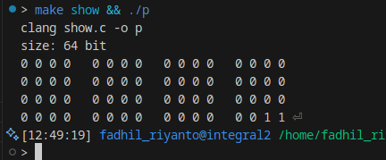

# print binary using shift and masking

## 8 bit int
lets play with small number first, imagine we want print 200 into binary, which is `0b11001000`, this is how I do

### step 0
identify how many bits we need?
say, char has 1 byte, int has 4 byte, long long has 8 byte. just multiply it with 8. you'll get the bit.

- 1 * 8 = 8 bit
- 4 * 8 = 32 bit
- 8 * 8 = 64 bit

### step 1
mask, lets see this pattern

```text
0b11001000
0b10000000
---------- &
0b10000000
```

see? `0b10000000`, which is `0x80`, what about `0x8`? its `0x1000`. find that? by shift left the bit, we turn `0x8` into `0x80`

lets follow this pattern

- 0x8 << 0  = 0x8 			(4 bit)
- 0x8 << 4  = 0x80     		(8 bit) <--- this is mask
- 0x8 << 8  = 0x800     	(12 bit)
- 0x8 << 12 = 0x8000     	(16 bit) <--- this is mask
- 0x8 << 16 = 0x80000  		(20 bit)

when I want mask 8 bit int? the mask is 0x80 because its perfectly fit `0b10000000`, if I want mask 16 bit int? the mask is 0x8000, because its fit `0b1000000000000000` 16 bit int, can filter the MSB

conlusion: 
the mask that we will use, is 

`0x8 << BIT_SIZE - 4`

SAY, `BIT_SIZE` is 8 (eight bit int), 8 - 4 is 4, `0x8 << 4 = 0x80`
same thing with

BIT_SIZE is 16, then 16 - 4 = 12, `0x8 << 12 = 0x8000`

okay, the mask has been clearly explained

### step 3, shifting
say, I have 8 bit int. `0b11100011`, when I mask it

#### n = 1
```
0b11100011
0b10000000
---------- &
0b10000000
```

lets continue shift to left 
#### n = 2
```
0b11000110
0b10000000
---------- &
0b10000000
```
#### n = 3
```
0b10001100
0b10000000
---------- &
0b10000000
```
#### n = 4
```
0b00011000
0b10000000
---------- &
0b0000000
```
#### n = 5
```
0b00110000
0b10000000
---------- &
0b00000000
```
#### n = 6
```
0b01100000
0b10000000
---------- &
0b00000000
```

#### n = 7
```
0b11000000
0b10000000
---------- &
0b10000000
```
#### n = 8
```
0b10000000
0b10000000
---------- &
0b10000000
```
### obtaining result
lets see this pattern

`0b10000000 0b10000000 0b10000000 0b0000000 0b00000000 0b00000000 0b10000000 0b10000000`

if we use if else, to match whatever one byte is same as 0b10000000 or not, we will get result
`1110 0011`

YES, we successfully turn int 8 bit into binary presentation

### example
```c
#include <stddef.h>
#include <stdio.h>

int main() {
        long long x = 3;

        size_t BIT_SIZE = sizeof(x) * 8;
        printf("size: %zu bit\n", BIT_SIZE);

        long long big_mask = (0x8ULL << (BIT_SIZE - 4));

        int counter = 0;
        for (int i = 0; i < BIT_SIZE; i++) {
                if (i % 4 == 0 && i != 0) {
                        printf("  ");
                }

                if (i % 16 == 0 && i != 0) {
                        printf("\n");
                }

                
                long int y = x & big_mask;
                printf("%d ", y == big_mask ? 1 : 0);
                x = x << 1;
        }
       
}
```

