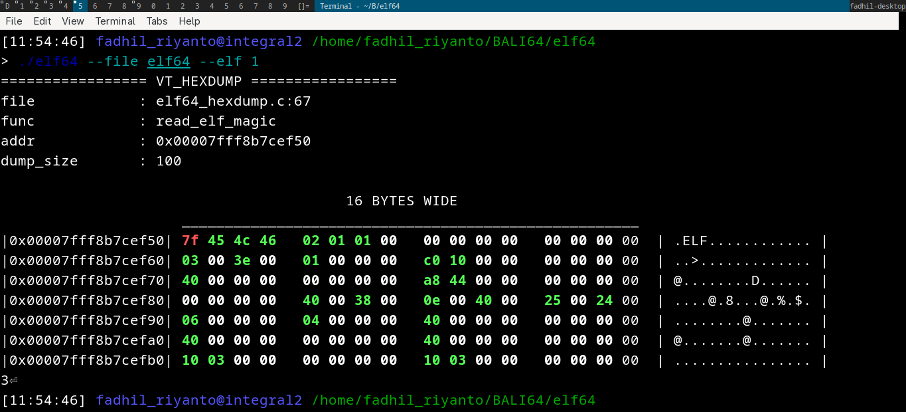

# vt-hexdump

```c
/* SPDX-License-Identifier: GPL-2.0-only */
/*
 * Copyright (C) Fadhil Riyanto <fadhil.riyanto@gnuweeb.org>
 *
 * this version is inspired by Ammar Faizi's versions
 * ref: https://gist.githubusercontent.com/ammarfaizi2/e88a21171358b5092a3df412eeb80b2f/raw/59141b48f59b70b1e96208716c45b1703c56daa7/vt_hexdump.h
 */

#include <complex.h>
#include <stddef.h>
#include <stdint.h>
#include <stdio.h>
#include <string.h>

#ifndef VT_HEXDUMP_COLOR
#define VT_HEXDUMP_COLOR(fmt, vt_hexdump_hex)                                   \
        char current_hex = (char)vt_hexdump_hex;                                \
                                                                                \
        if (current_hex == 0x7F) {                                              \
                printf("\033[1;31m" fmt "\033[0m", vt_hexdump_hex);             \
        } else if (current_hex == 0xFF) {                                       \
                printf("\033[1;34m" fmt "\033[0m", vt_hexdump_hex);             \
        } else if (current_hex == 0x00) {                                       \
                printf("\033[1;37m" fmt "\033[0m", vt_hexdump_hex);             \
        } else {                                                                \
                printf("\033[1;32m" fmt "\033[0m", vt_hexdump_hex);             \
        }                                                                       \
        
#endif /* VT_HEXDUMP_COLOR */

#define VT_TITLE(PTR, SIZE)                                                     \
        size_t t_ptr_size = SIZE;                                                 \
        unsigned char *t_realptr = (unsigned char*)PTR;                           \
        printf("================= VT_HEXDUMP =================\n");             \
        printf("file\t\t: %s:%d\n", __FILE__, __LINE__);                        \
        printf("func\t\t: %s\n", __FUNCTION__);                                 \
        printf("addr\t\t: 0x%016lx\n", t_realptr);                                \
        printf("dump_size\t: %ld\n\n", t_ptr_size);

#ifndef HEXDUMP
#define HEXDUMP(PTR, SIZE)                                                      \
        size_t ptr_size = SIZE;                                                 \
        unsigned char *realptr = (unsigned char*)PTR;                           \
        unsigned int initial_counter = 0;                                       \
                                                                                \
        int n_loop = (ptr_size / 16) + 1;                                       \
        if (ptr_size % 16 == 0) {                                               \
                n_loop = n_loop - 1;                                            \
        }                                                                       \
                                                                                \
        for (int x = 0; x < 75; x++) {                                          \
                if (x >= 40) {                                                  \
                        printf("16 BYTES WIDE\n");                              \
                        break;                                                  \
                } else {                                                        \
                        printf(" ");                                            \
                }                                                               \
        }                                                                       \
                                                                                \
        for (int x = 0; x < 75; x++) {                                          \
                if (x >= 21 && x <= 73) {                                       \
                        printf("_");                                            \
                } else {                                                        \
                        printf(" ");                                            \
                }                                                               \
        }                                                                       \
        printf("\n");                                                           \
                                                                                \
        for (int i = 0; i < n_loop; i++) {                                      \
                printf("|0x%016lx|", (uintptr_t)(realptr));                     \
                                                                                \
                for (int i = 0; i < 16; i++) {                                  \
                        if (i % 4 == 0 && i != 0) {                             \
                                printf("  ");                                   \
                        }                                                       \
                        if (i != 15) {                                          \
                                if (initial_counter <= ptr_size) {              \
                                        VT_HEXDUMP_COLOR(" %02x", realptr[i]);  \
                                }                                               \
                        } else {                                                \
                                printf(" %02x ", realptr[i]);                   \
                        }                                                       \
                }                                                               \
                                                                                \
                printf(" | ");                                                  \
                for (int i = 0; i < 16; i++) {                                  \
                        if (initial_counter <= ptr_size - 1) {                  \
                                if (realptr[i] >= 32 && realptr[i] <= 126) {    \
                                        printf("%c", realptr[i]);               \
                                } else {                                        \
                                        printf(".", realptr[i]);                \
                                }                                               \
                        } else {                                                \
                                printf(".");                                    \
                        }                                                       \
                        initial_counter = initial_counter + 1;                  \
                }                                                               \
                printf(" | ");                                                  \
                                                                                \
                printf("\n");                                                   \
                realptr = realptr + 16;                                         \
        }
#endif                                     

#ifndef VT_HEXDUMP
#define VT_HEXDUMP(PTR, SIZE)                                                   \
        VT_TITLE(PTR, SIZE);                                                             \
        HEXDUMP(PTR, SIZE);
#endif

```

